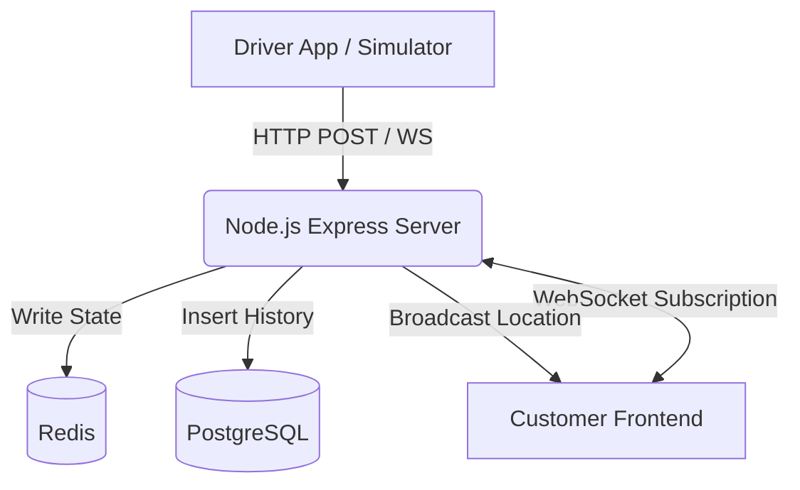

# System Architecture

## 1. Project Overview
This project is a Monolithic Real-Time Location Tracking System designed as a portfolio piece. It tracks drivers' GPS locations and displays them to customers on a live map using a single Node.js backend.

## 2. Goals
- Provide real-time tracking of drivers.
- Demonstrate a clean, easy-to-understand full-stack application.
- Show proficiency with WebSockets, Redis (caching), and PostgreSQL (persistence).

## 3. Architecture Design
This project uses a simple client-server monolith approach rather than complex microservices, making it perfectly suited for a portfolio feature showcase.

## 4. Components
- **Client App**: A React/Next.js application displaying a live map.
- **Node.js Server**: An Express server handling HTTP ingress and WebSocket connections.
- **Redis**: Stores the exact current location of drivers for fast retrieval.
- **PostgreSQL**: Stores persistent entities like `User`, `Driver`, `Ride`, and `LocationHistory`.

## 5. Flow of Data
1. A driver sends their coordinates (`{ lat, lng, driverId }`) to the Node.js Server.
2. The Server updates Redis with the new location (overwriting the old one).
3. The Server inserts a record into PostgreSQL's `LocationHistory` table.
4. The Server immediately broadcasts this location payload to any WebSockets subscribed to that `driverId`.
5. The Client App receives the WebSocket message and smoothly moves the marker on the map.

## 6. Why a Monolith?
For a single-feature portfolio project, a monolith reduces infrastructure overhead, simplifies deployment, and makes the codebase much easier to read and maintain, while still demonstrating the core concepts of real-time bidirectional data flow.
