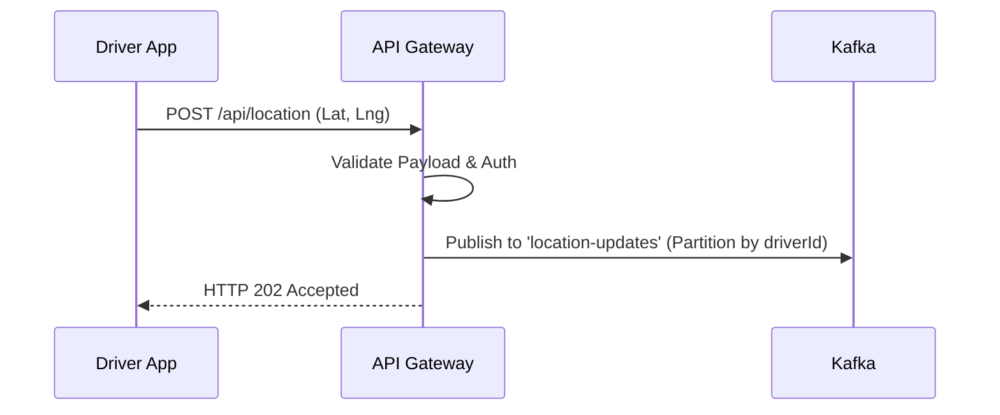
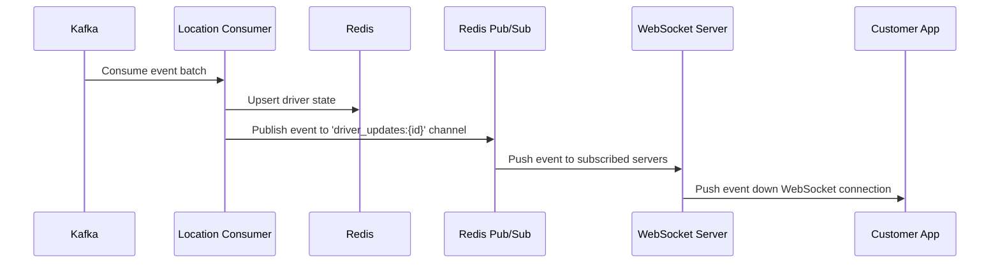
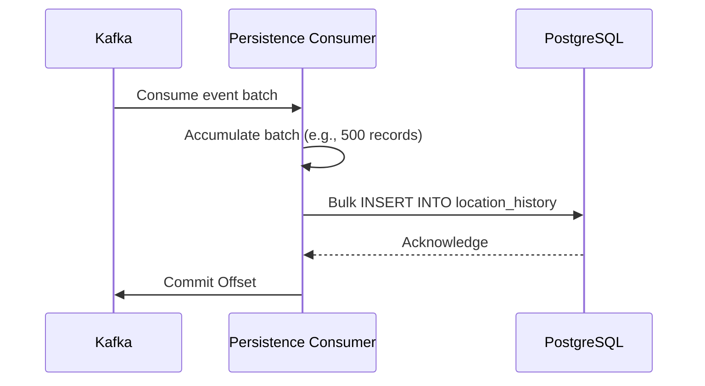

# Data Flow

## 1. Location Event Ingestion

```mermaid
sequenceDiagram
    participant D as Driver App
    participant GW as API Gateway
    participant K as Kafka
    
    D->>GW: POST /api/location (Lat, Lng)
    GW->>GW: Validate Payload & Auth
    GW->>K: Publish to 'location-updates' (Partition by driverId)
    GW-->>D: HTTP 202 Accepted
```

## 2. Location Processing & Broadcasting

```mermaid
sequenceDiagram
    participant K as Kafka
    participant LC as Location Consumer
    participant R as Redis
    participant RPS as Redis Pub/Sub
    participant WS as WebSocket Server
    participant C as Customer App

    K->>LC: Consume event batch
    LC->>R: Upsert driver state
    LC->>RPS: Publish event to 'driver_updates:{id}' channel
    RPS->>WS: Push event to subscribed servers
    WS->>C: Push event down WebSocket connection
```

## 3. Location Persistence

```mermaid
sequenceDiagram
    participant K as Kafka
    participant PC as Persistence Consumer
    participant DB as PostgreSQL

    K->>PC: Consume event batch
    PC->>PC: Accumulate batch (e.g., 500 records)
    PC->>DB: Bulk INSERT INTO location_history
    DB-->>PC: Acknowledge
    PC->>K: Commit Offset
```
