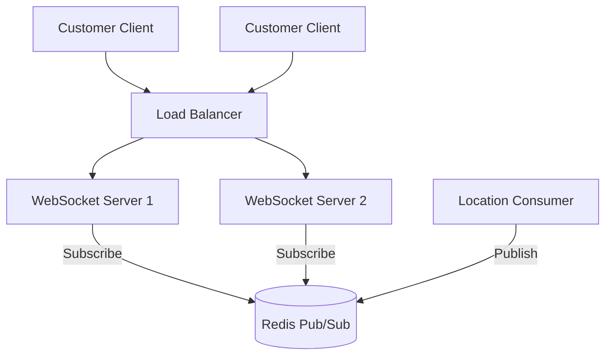

# WebSocket Architecture

## Purpose
WebSockets provide full-duplex, persistent connections for real-time communication. This avoids the overhead and latency of clients repeatedly HTTP polling for driver locations.

## Architecture

## The "Multiple Server" Problem
When a system scales, you run multiple WebSocket server instances. 
If Driver A sends a location update, it might be processed and stored. If Customer B is connected to WS-Server-2, how does WS-Server-2 know about the update if the event arrived at a different server?

**Solution**: 
We use a Pub/Sub mechanism (e.g., Redis Pub/Sub). 
When the Kafka Location Consumer updates the state in Redis, it *also* publishes a message to a Redis Pub/Sub channel (`driver:123:updates`). 
All WebSocket servers listen to these channels. If a WS server has a client subscribed to `driver:123`, it receives the Pub/Sub message and forwards it down the WebSocket to the specific client.

## Connection Lifecycle
1. **Connect**: Client connects, passing a JWT.
2. **Authenticate**: Server verifies JWT. If invalid, drops connection.
3. **Subscribe**: Client sends `{ action: 'subscribe', driverId: '123' }`.
4. **Initial State**: Server fetches current location from Redis and sends it to the client.
5. **Listen**: Server listens to internal Pub/Sub for future updates and forwards them.
6. **Disconnect**: Client drops, Server cleans up subscriptions.

## Heartbeats and Reconnection
WebSockets can silently fail. 
- The server must periodically send a `PING`.
- The client must respond with a `PONG`.
- If the server misses X consecutive PONGs, it forcefully closes the stale connection to free up memory.
- The client must implement exponential backoff logic to reconnect if the connection drops.
